# MLPerf™ Tiny Deep Learning Benchmarks for STM32 devices
The goal of MLPerf™ Tiny is to provide a representative set of deep neural nets
and benchmarking code to compare performance between embedded devices. These devices
typically run at between 10MHz and 250MHz, and can perform inference using less
then 50mW of power.

For this Benchmark we are suggesting 3 Boards:

- [NUCLEO-H7A3ZI-Q](https://www.st.com/en/evaluation-tools/nucleo-h7a3zi-q.html#sample-buy)
- [NUCLEO-U575ZI-Q](https://www.st.com/en/evaluation-tools/nucleo-u575zi-q.html#sample-buy)
- [NUCLEO-L4R5ZI](https://www.st.com/en/evaluation-tools/nucleo-l4r5zi.html#sample-buy)

In this guide, we will learn how to generate the projects for the previous boards.

## Before You Start
You need to download and install the following software:

- [STM32CubeMX](https://www.st.com/en/development-tools/stm32cubemx.html)   ( v6.4.0 )
- [STM32CubeIDE](https://www.st.com/en/development-tools/stm32cubeide.html)  ( v1.8.0 )
- [STM32CubeProg](https://www.st.com/en/development-tools/stm32cubeprog.html) ( v2.9.0 )

The following Nucleo boards are required:
- [NUCLEO-H7A3ZI-Q](https://www.st.com/en/evaluation-tools/nucleo-h7a3zi-q.html#sample-buy)
- [NUCLEO-U575ZI-Q](https://www.st.com/en/evaluation-tools/nucleo-u575zi-q.html#sample-buy)
- [NUCLEO-L4R5ZI](https://www.st.com/en/evaluation-tools/nucleo-l4r5zi.html#sample-buy)

Also we need to download  the following pretrained quantized model from MLCommons™ Github:

- [Anomaly Detection](https://github.com/mlcommons/tiny/blob/master/benchmark/training/anomaly_detection/trained_models/ad01_int8.tflite)
- [Image Classification](https://github.com/mlcommons/tiny/blob/master/benchmark/training/image_classification/trained_models/pretrainedResnet_quant.tflite)
- [Keyword Spotting](https://github.com/mlcommons/tiny/blob/master/benchmark/training/keyword_spotting/trained_models/kws_ref_model.tflite)
- [Person Detection](https://github.com/mlcommons/tiny/blob/master/benchmark/training/visual_wake_words/trained_models/vww_96_int8.tflite)

## NUCLEO-H7A3ZI-Q Projects
In this section we will explain how to generate the different benchmark projects for the **NUCLEO-H7A3ZI-Q** board.
We will take the Image Classification benchmark project as an example and then exactly the same steps should be repeated for the rest of the scenarios (Anomaly Detection, Keyword Spotting and Person Detection)

### Generate the project using STM32CubeMX
**1. Download the [Image Classification](https://github.com/mlcommons/tiny/blob/master/benchmark/training/image_classification/trained_models) model and then save it under**
```bash
...\NUCLEO_H7A3ZI_Q\image_classification
```
You should have something like this to start:
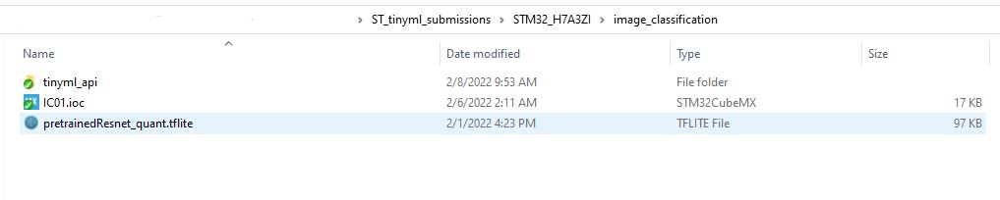

**2. Open the .ioc file and follow the next steps to generate your project template:**

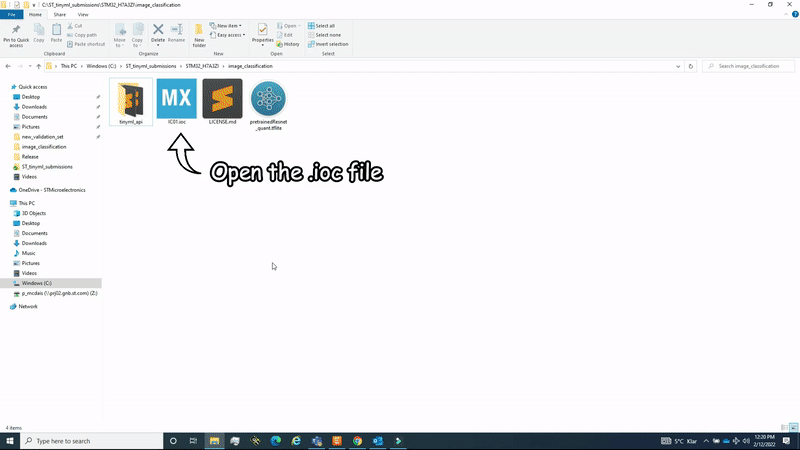

### Configure and build the project using STM32CubeIDE

After generating the project using STM32CubeMX you should have something like this in your workspace:

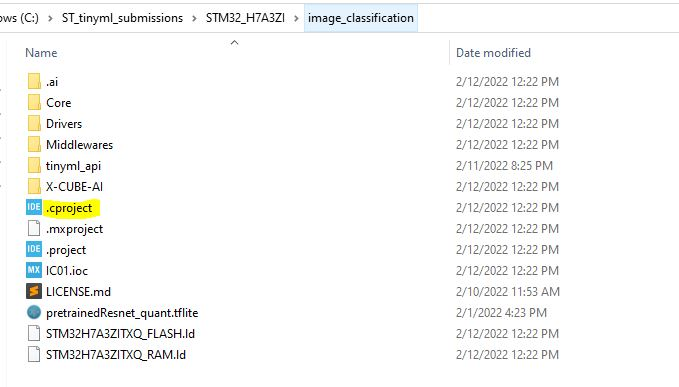

**1. Open the .cproject file and follow the next steps to configure your project:**

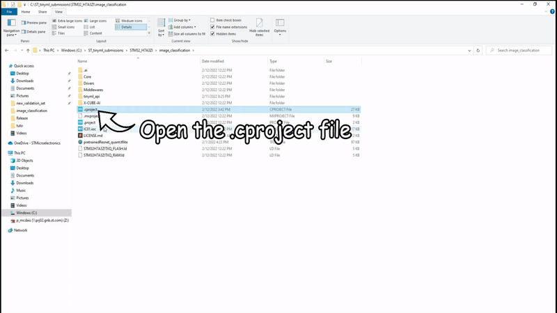

**2. Modify the main.c file:**

2.1 Open main.c located under Project Explorer:

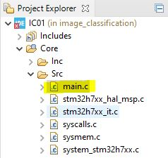

2.2 Under Private includes add the following:
```bash
/* Private includes ----------------------------------------------------------*/
/* USER CODE BEGIN Includes */
#include "submitter_implemented.h"
/* USER CODE END Includes */
```

2.3 Replace any initial code between:
```bash
 /* Initialize all configured peripherals */
 .
 .
 .
 /* USER CODE BEGIN 2 */
```
by the following:
```bash
  /* Initialize all configured peripherals */
  /* USER CODE BEGIN 2 */
  MX_GPIO_Init();
  MX_CRC_Init();
#if EE_CFG_ENERGY_MODE == 0
  MX_USART3_UART_Init();
#else
  MX_USART1_UART_Init();
#endif

#if EE_CFG_ENERGY_MODE == 0
  __HAL_UART_ENABLE_IT(&huart3,UART_IT_RXNE);
#else
  __HAL_UART_ENABLE_IT(&huart1,UART_IT_RXNE);
#endif

  MX_TIM5_Init();
  HAL_TIM_Base_Start(&htim5);
  ee_benchmark_initialize();
  /* USER CODE END 2 */
```
**2. Modify the stm32h7xx_it.c file:**

2.1 Open stm32h7xx_it.c located under Project Explorer:

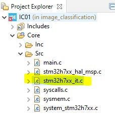

2.2 Delete any initial code in the file located after the following lines:
```bash
/******************************************************************************/
/* STM32H7xx Peripheral Interrupt Handlers                                    */
/* Add here the Interrupt Handlers for the used peripherals.                  */
/* For the available peripheral interrupt handler names,                      */
/* please refer to the startup file (startup_stm32h7xx.s).                    */
/******************************************************************************/
```

**3. Build the project in Release mode:**

Set the project to the release mode as the following and then click on build :

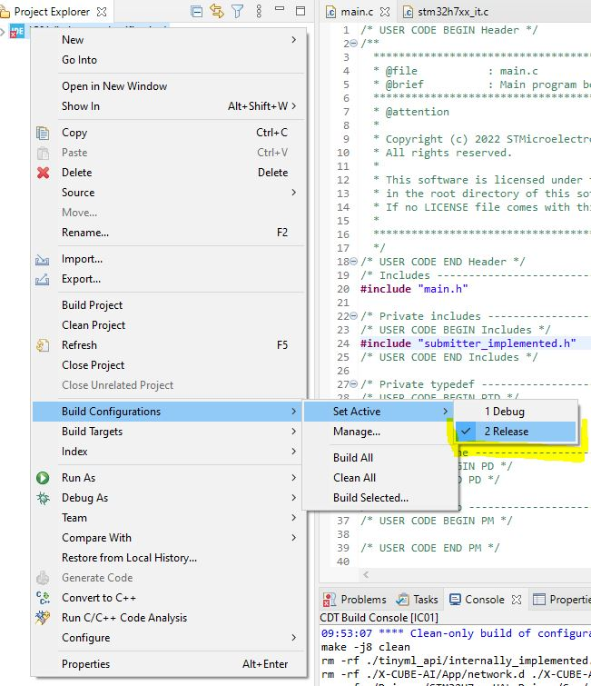

### Flash the board using STM32CubeProg
Next we will demonstarte how to flash your NUCLEO-H7A3ZI-Q board with the binary file you generated in the previous step

**1. Verify the board configuration:**

Make sure that your board has the the following jumpers fitted:

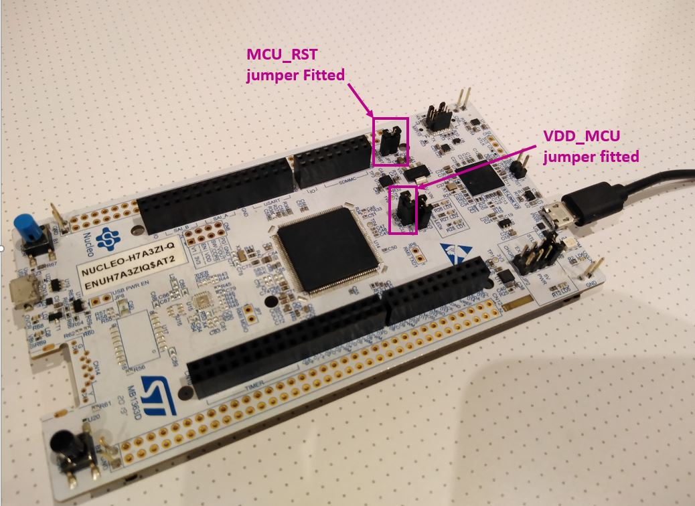


**2. Flash the board:**

Connect the board to the laptop using a usb cable and use STM32CubeProg to flash the board as the following:


### NUCLEO-H7A3ZI-Q Energy mode setup

For energy mode the **EE_CFG_ENERGY_MODE** flag should be set to **1**.

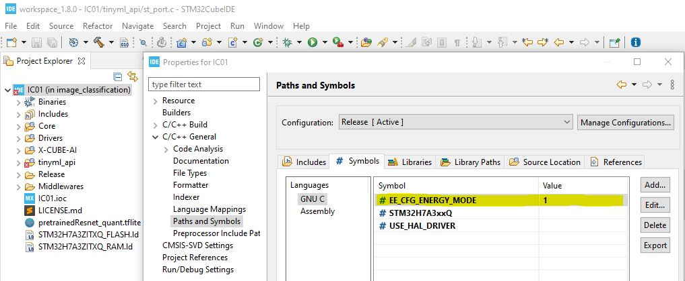

You need to make sure that the **MCU_RST** and the **MCU_VDD** jumpers are **not fitted**.

The final setup should look like the following:

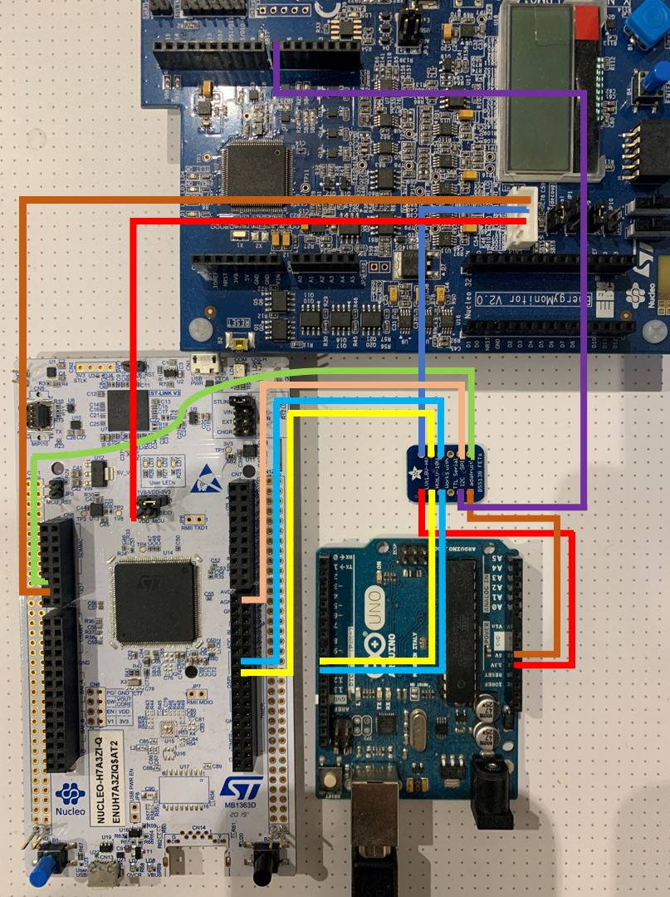

**Make sure to push the Reset Button (the Black Button) on the board before starting the benchmark software.**

For more details about the energy benchmark and EEMBCs EnergyRunner™ benchmark framework please refer to this [link](https://github.com/eembc/energyrunner) 

### Performance mode setup

For Performance mode the **EE_CFG_ENERGY_MODE** flag should be set to **0**.

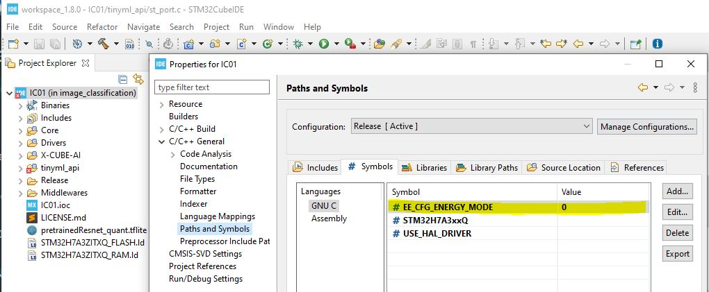

The board should be connected to the laptop using a usb cable and you need to make sure that the **MCU_RST** and the **MCU_VDD** jumpers are **fitted**.

**Make sure to push the Reset Button (the Black Button) on the board before starting the benchmark software.**

For more details about the Performance mode and EEMBCs EnergyRunner™ benchmark framework please refer to this [link](https://github.com/eembc/energyrunner) 

## NUCLEO-U575ZI-Q Projects
In this section we will explain how to generate the different benchmark projects for the **NUCLEO-U575ZI-Q** board.
We will take the Anomaly Detection benchmark project as an example and then exactly the same steps should be repeated for the rest of the scenarios (Image Classification, Keyword Spotting and Person Detection)

### Generate the project using STM32CubeMX
**1. Download the [Anomaly Detection](https://github.com/mlcommons/tiny/blob/master/benchmark/training/anomaly_detection/trained_models/ad01_int8.tflite) model and then save it under**
```bash
...\NUCLE_U575ZI_Q\anomaly_detection
```
You should have something like this to start:

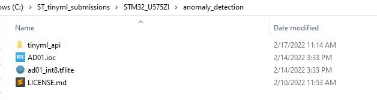

**2. Open the .ioc file and follow the next steps to generate your project template:**

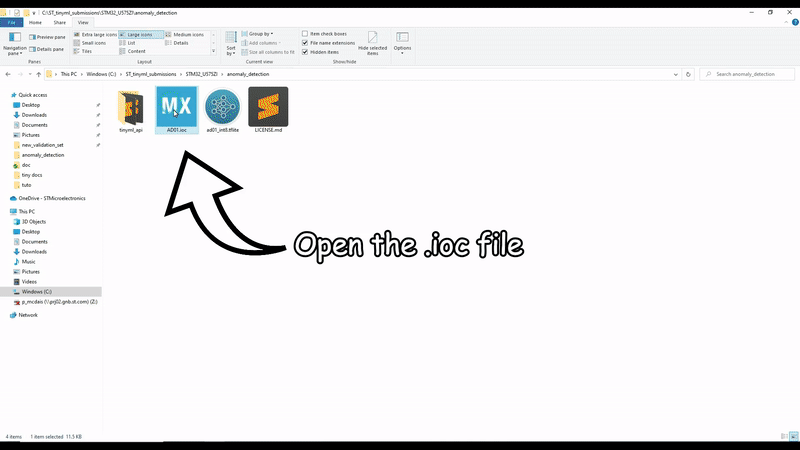

### Configure and build the project using STM32CubeIDE
After generating the project using STM32CubeMX you should have something like this in your workspace:

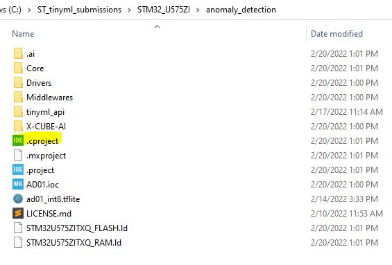

**1. Open the .cproject file and follow the next steps to configure your project:**

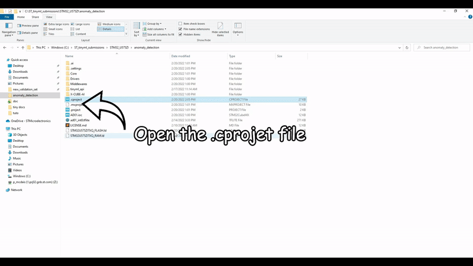

**2. Modify the main.c file:**

2.1 Open main.c located under Project Explorer:

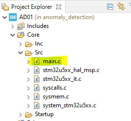

2.2 Under Private includes add the following:
```bash
/* Private includes ----------------------------------------------------------*/
/* USER CODE BEGIN Includes */
#include "submitter_implemented.h"
/* USER CODE END Includes */
```

2.3 Replace any initial code between:
```bash
 /* Initialize all configured peripherals */
 .
 .
 .
 /* USER CODE BEGIN 2 */
```
by the following:
```bash
  /* Initialize all configured peripherals */
  /* USER CODE BEGIN 2 */
  MX_GPIO_Init();
  MX_CRC_Init();
  MX_DCACHE1_Init();
  MX_ICACHE_Init();
#if EE_CFG_ENERGY_MODE == 1
  MX_LPUART1_UART_Init();
#else
  MX_USART1_UART_Init();
#endif

#if EE_CFG_ENERGY_MODE == 0
  __HAL_UART_ENABLE_IT(&huart1,UART_IT_RXNE);
#else
  __HAL_UART_ENABLE_IT(&hlpuart1,UART_IT_RXNE);
#endif

  MX_TIM5_Init();
  HAL_TIM_Base_Start(&htim5);
  ee_benchmark_initialize();
  /* USER CODE END 2 */
```

2.4 Enable SMPS by adding the following lines of code:

```bash
  /* USER CODE END ICACHE_Init 2 */
  __HAL_RCC_PWR_CLK_ENABLE();

  /*Enable ultra low power mode NJ: to enable with cut2.1 fix*/
  HAL_PWREx_EnableUltraLowPowerMode();

  /*The SMPS regulator supplies the Vcore Power Domains.*/
  HAL_PWREx_ConfigSupply(PWR_SMPS_SUPPLY);

  /* Enable Power Control clock */
  __HAL_RCC_PWR_CLK_DISABLE();

  /* USER CODE END ICACHE_Init 2 */
```
You should have something like this at the end:

```bash
static void MX_ICACHE_Init(void)
{

  /* USER CODE BEGIN ICACHE_Init 0 */

  /* USER CODE END ICACHE_Init 0 */

  /* USER CODE BEGIN ICACHE_Init 1 */

  /* USER CODE END ICACHE_Init 1 */
  /** Enable instruction cache (default 2-ways set associative cache)
  */
  if (HAL_ICACHE_Enable() != HAL_OK)
  {
    Error_Handler();
  }
    /* USER CODE END ICACHE_Init 2 */
  __HAL_RCC_PWR_CLK_ENABLE();

  /*Enable ultra low power mode NJ: to enable with cut2.1 fix*/
  HAL_PWREx_EnableUltraLowPowerMode();

  /*The SMPS regulator supplies the Vcore Power Domains.*/
  HAL_PWREx_ConfigSupply(PWR_SMPS_SUPPLY);

  /* Enable Power Control clock */
  __HAL_RCC_PWR_CLK_DISABLE();

  /* USER CODE END ICACHE_Init 2 */

}
```
**2. Modify the stm32u5xx_it.c file:**

2.1 Open stm32u5xx_it.c located under Project Explorer:

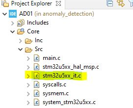

2.2 Delete any initial code in the file located after the following lines:
```bash
/******************************************************************************/
/* STM32U5xx Peripheral Interrupt Handlers                                    */
/* Add here the Interrupt Handlers for the used peripherals.                  */
/* For the available peripheral interrupt handler names,                      */
/* please refer to the startup file (startup_stm32u5xx.s).                    */
/******************************************************************************/
```

**3. Build the project in Release mode:**

Set the project to the release mode as the following and then click on build :

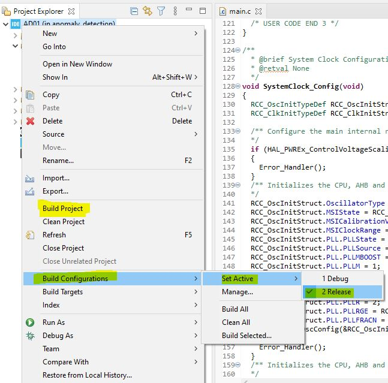

### Flash the board using STM32CubeProg
Next we will demonstarte how to flash your NUCLEO-U575ZI-Q board with the binary file you generated in the previous step

**1. Verify the board configuration:**

Make sure that your board has the the following jumpers fitted:

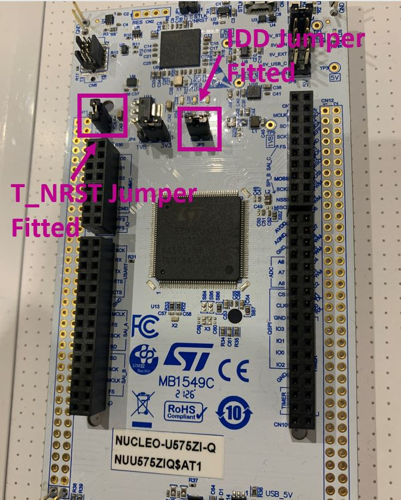


**2. Flash the board:**

Connect the board to the laptop using a usb cable and use STM32CubeProg to flash the board as the following:

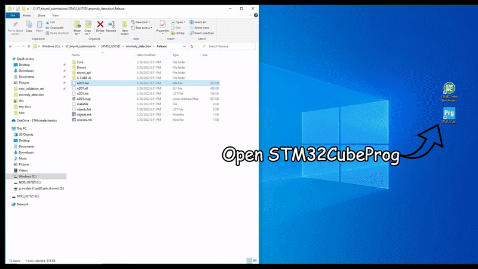

### NUCLEO-U575ZI-Q Energy mode setup

For energy mode the **EE_CFG_ENERGY_MODE** flag should be set to **1**.

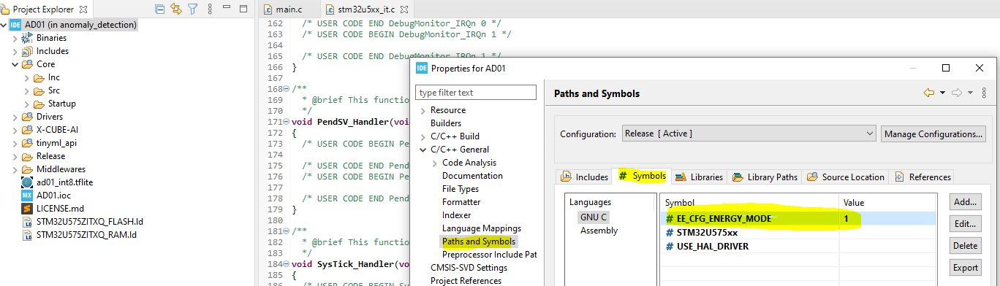

You need to make sure that the **T_NRST** and the **IDD** jumpers are **not fitted**.

The final setup should look like the following:

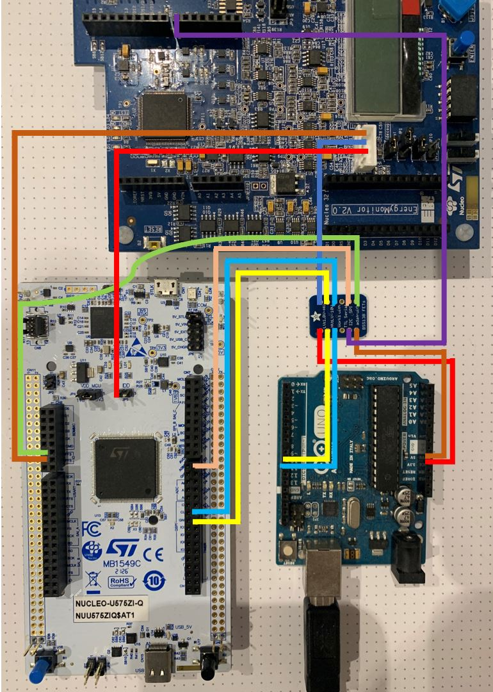

**Make sure to push the Reset Button (the Black Button) on the board before starting the benchmark software.**

For more details about the energy benchmark and EEMBCs EnergyRunner™ benchmark framework please refer to this [link](https://github.com/eembc/energyrunner) 

### Performance mode setup

For Performance mode the **EE_CFG_ENERGY_MODE** flag should be set to **0**.

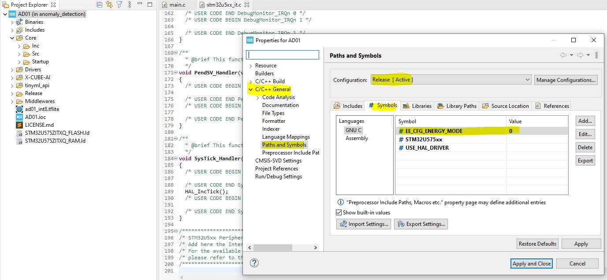

The board should be connected to the laptop using a usb cable and you need to make sure that the **T_NRST** and the **IDD** jumpers are **fitted**.

**Make sure to push the Reset Button (the Black Button) on the board before starting the benchmark software.**

For more details about the Performance mode and EEMBCs EnergyRunner™ benchmark framework please refer to this [link](https://github.com/eembc/energyrunner) 

## NUCLEO-L4R5ZI Projects

In this section we will explain how to generate the different benchmark projects for the **NUCLEO-L4R5ZI** board.
We will take the Person Detection benchmark project as an example and then exactly the same steps should be repeated for the rest of the scenarios (Anomaly Detection, Keyword Spotting and Image Classification)

### Generate the project using STM32CubeMX

**1. Download the [Person Detection](https://github.com/mlcommons/tiny/blob/master/benchmark/training/visual_wake_words/trained_models/vww_96_int8.tflite) model and then save it under**
```bash
...\NUCLEO_L4R5ZI\person_detection
```
You should have something like this to start:

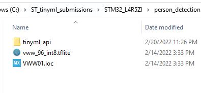

**2. Open the .ioc file and follow the next steps to generate your project template:**

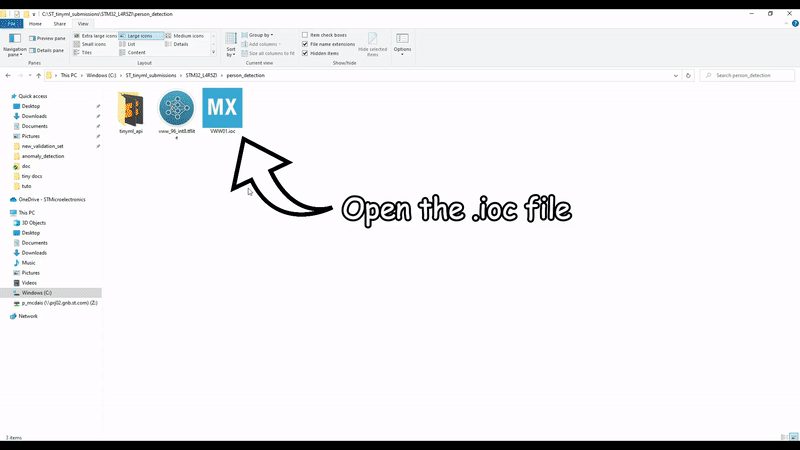

### Configure and build the project using STM32CubeIDE

After generating the project using STM32CubeMX you should have something like this in your workspace:

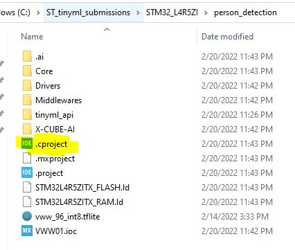

**1. Open the .cproject file and follow the next steps to configure your project:**

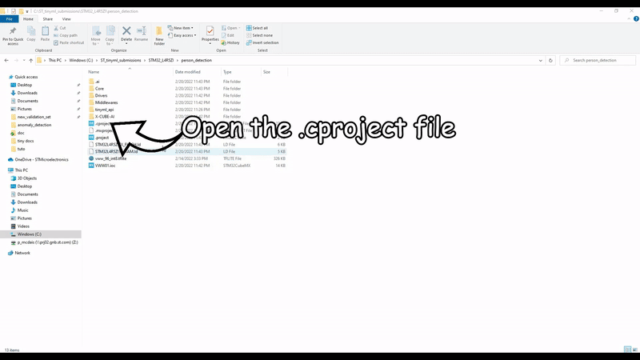

**2. Modify the main.c file:**

2.1 Open main.c located under Project Explorer:


2.2 Under Private includes add the following:
```bash
/* Private includes ----------------------------------------------------------*/
/* USER CODE BEGIN Includes */
#include "submitter_implemented.h"
/* USER CODE END Includes */
```

2.3 Replace any initial code between:
```bash
 /* Initialize all configured peripherals */
 .
 .
 .
 /* USER CODE BEGIN 2 */
```
by the following:
```bash
  /* Initialize all configured peripherals */
  /* USER CODE BEGIN 2 */
  MX_GPIO_Init();
  MX_CRC_Init();
#if EE_CFG_ENERGY_MODE == 1
  MX_USART3_UART_Init();
#else
  MX_LPUART1_UART_Init();
#endif

#if EE_CFG_ENERGY_MODE == 1
  __HAL_UART_ENABLE_IT(&huart3,UART_IT_RXNE);
#else
  __HAL_UART_ENABLE_IT(&hlpuart1,UART_IT_RXNE);
#endif

  MX_TIM5_Init();
  HAL_TIM_Base_Start(&htim5);
  ee_benchmark_initialize();
  /* USER CODE END 2 */
```
**2. Modify the stm32l4xx_it.c file:**

2.1 Open stm32l4xx_it.c located under Project Explorer:

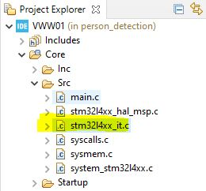

2.2 Delete any initial code in the file located after the following lines:
```bash
/******************************************************************************/
/* STM32L4xx Peripheral Interrupt Handlers                                    */
/* Add here the Interrupt Handlers for the used peripherals.                  */
/* For the available peripheral interrupt handler names,                      */
/* please refer to the startup file (startup_stm32l4xx.s).                    */
/******************************************************************************/
```

**3. Build the project in Release mode:**

Set the project to the release mode as the following and then click on build :

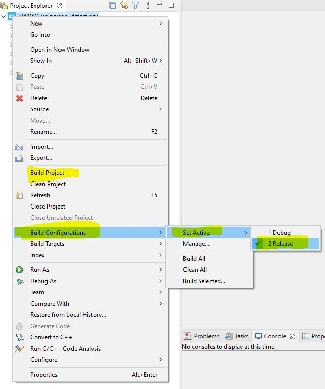

### Flash the board using STM32CubeProg

Next we will demonstarte how to flash your NUCLEO-L4R5ZI board with the binary file you generated in the previous step

**1. Verify the board configuration:**

Make sure that your board has the the following jumpers fitted:


**2. Flash the board:**

Connect the board to the laptop using a usb cable and use STM32CubeProg to flash the board as the following:

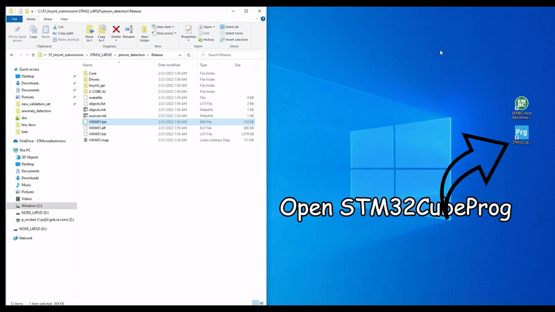

### NUCLEO-L4R5ZI Energy mode setup

For energy mode the **EE_CFG_ENERGY_MODE** flag should be set to **1**.

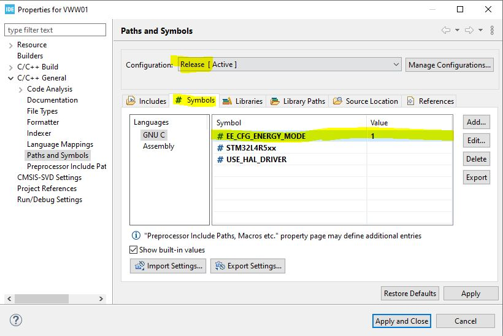

You need to make sure that the **MCU_RST** and the **IDD** jumpers are **not fitted**.

The final setup should look like the following:

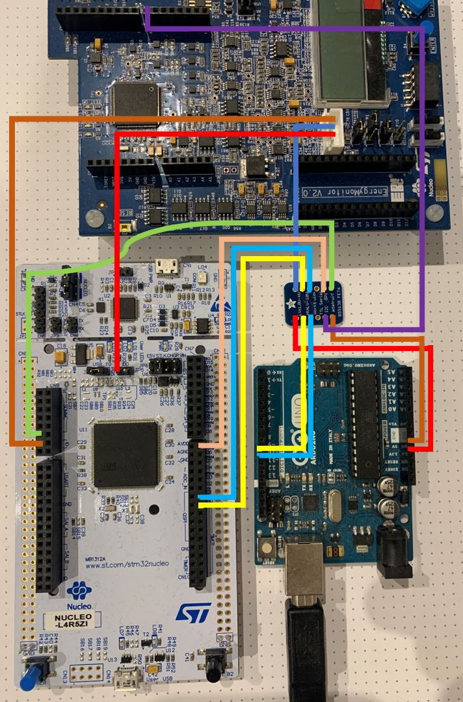

**Make sure to push the Reset Button (the Black Button) on the board before starting the benchmark software.**

For more details about the energy benchmark and EEMBCs EnergyRunner™ benchmark framework please refer to this [link](https://github.com/eembc/energyrunner) 

### Performance mode setup

For Performance mode the **EE_CFG_ENERGY_MODE** flag should be set to **0**.

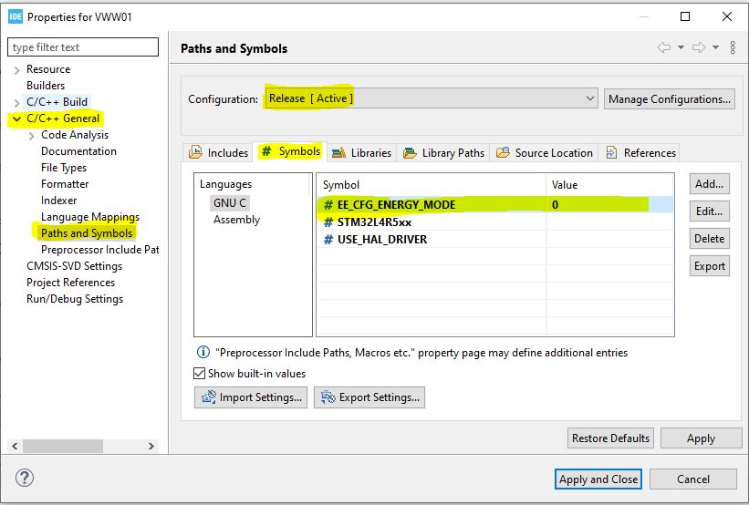

The board should be connected to the laptop using a usb cable and you need to make sure that the **MCU_RST** and the **IDD** jumpers are **fitted**.

**Make sure to push the Reset Button (the Black Button) on the board before starting the benchmark Software.**

For more details about the Performance mode and EEMBCs EnergyRunner™ benchmark framework please refer to this [link](https://github.com/eembc/energyrunner) 
