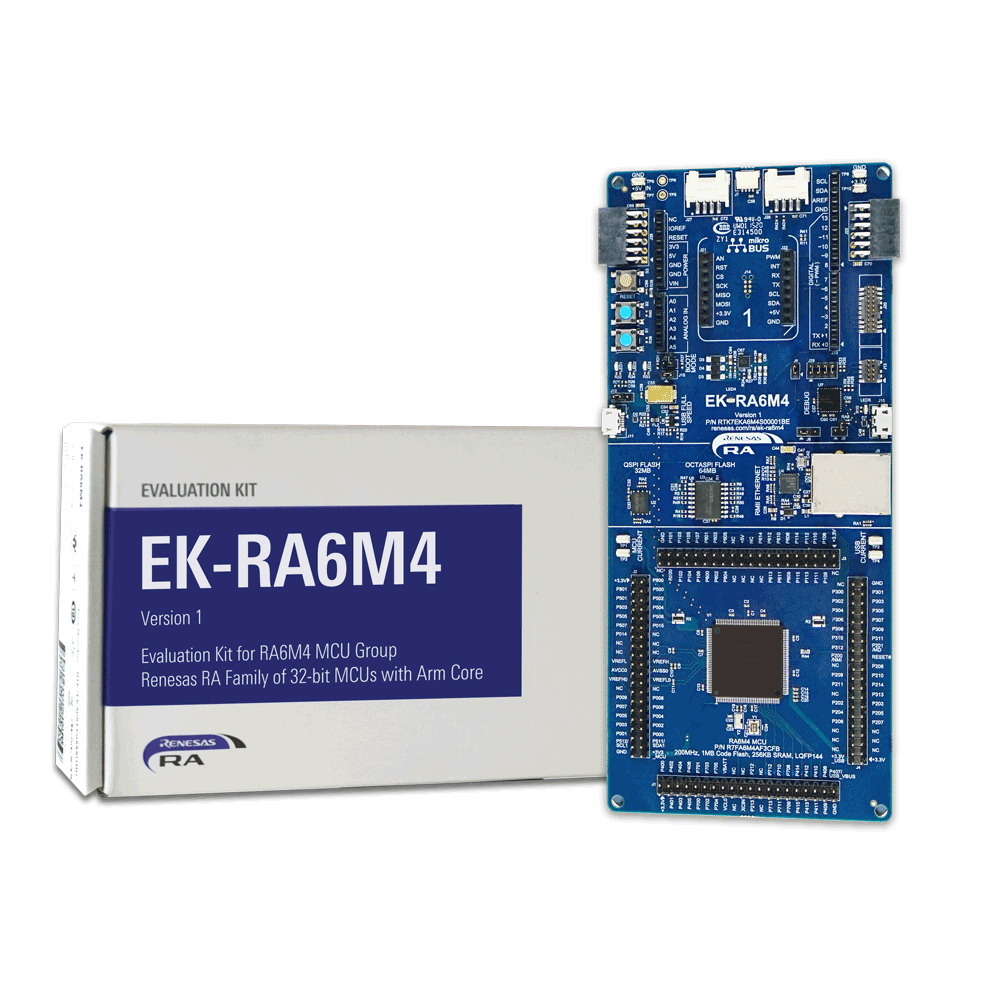
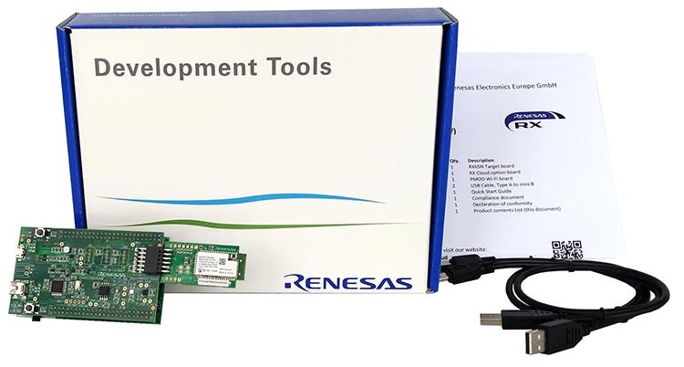
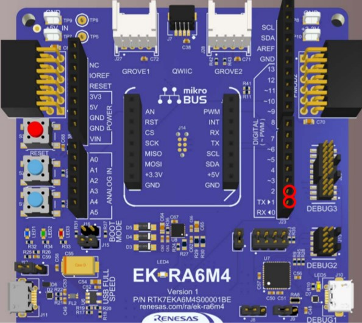
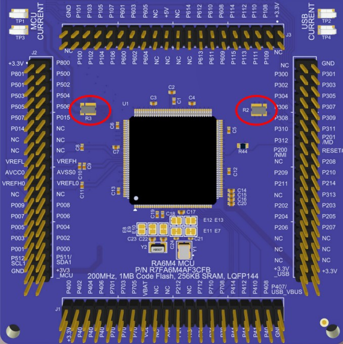
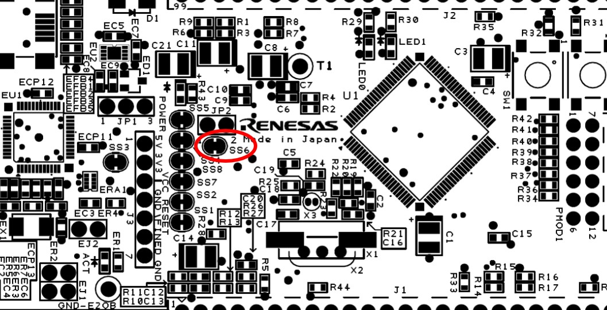
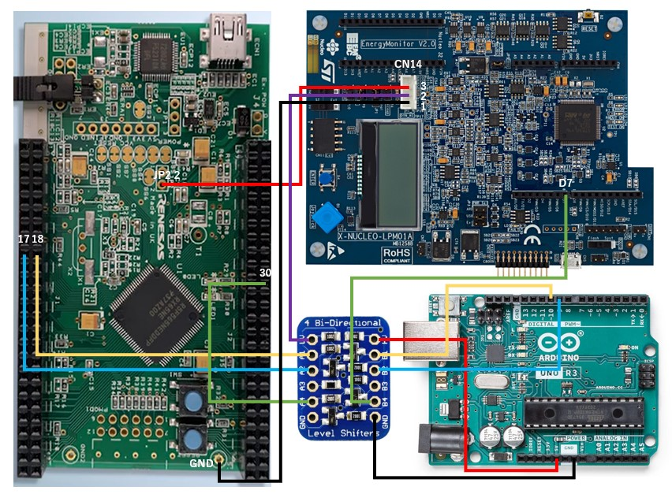

# Table of Contents
- [Table of Contents](#table-of-contents)
- [Overview](#overview)
- [Prerequisites](#prerequisites)
  - [Software](#software)
  - [Hardware (Renesas Products)](#hardware-renesas-products)
  - [Hardware (For Measurement)](#hardware-for-measurement)
- [Getting started with the benchmark projects](#getting-started-with-the-benchmark-projects)
  - [Import benchmark projects](#import-benchmark-projects)
  - [Build the project](#build-the-project)
- [Performance/Accuracy mode measurement](#performanceaccuracy-mode-measurement)
- [Energy mode measurement](#energy-mode-measurement)
# Overview

This is the directory for `Renesas TinyMLPerf Benchmarks v0.7 Closed Division`.
There are two projects, one for [EK-RA6M4](https://www.renesas.com/EK-RA6M4) and the other for [RX65N-Cloud-Kit](https://www.renesas.com/RX65N-Cloud-Kit).
You can switch from model to model by compiler flags so only two projects need to be imported into IDE.
Also you can change measurement modes, `Performance Mode`, `Energy Mode` and `Accuracy Mode` by editing a header file.
Further details will be provided hereafter.

# Prerequisites

To build & run the projects, you need SW/HW listed below.

## Software

- [Renesas e<sup>2</sup> studio IDE](https://www.renesas.com/jp/ja/software-tool/e-studio)
- [GNU Arm Embedded: 8.3.1.20190703 (for EK-RA6M4)](https://developer.arm.com/tools-and-software/open-source-software/developer-tools/gnu-toolchain/gnu-rm/downloads)
- [GCC for Renesas RX: 8.3.0.202004 (for RX65N-Cloud-Kit)](https://llvm-gcc-renesas.com/ja/rx-download-toolchains/)
- [EEMBC EnergyRunner<sup>TM</sup>: 3.0.10](https://github.com/eembc/energyrunner)

## Hardware (Renesas Products)

- [EK-RA6M4](https://www.renesas.com/EK-RA6M4)



- [RX65N-Cloud-Kit](https://www.renesas.com/RX65N-Cloud-Kit)



## [Hardware (For Measurement)](https://github.com/eembc/energyrunner#bill-of-materials)


| Component | Product | Links |
| --------- | ------------------- | ---- |
| Energy Monitor (50mA max.)     | STMicro. LPM01A (v1.0.6)    | [STM](https://estore.st.com/en/products/evaluation-tools/product-evaluation-tools/stm32-nucleo-expansion-boards/x-nucleo-lpm01a.html) |
| Level Shifter | BSS138 x4 | [Digikey](https://www.digikey.com/en/products/detail/adafruit-industries-llc/757/4990756) |
| IO Manager | Arduino UNO | [DigiKey](https://www.digikey.com/en/products/detail/arduino/A000066/2784006) |
| Breadboard | SAD-101 | [chip1stop](https://static.chip1stop.com/URY/en/view/dispDetail/DispDetail?mpn=SAD-101&partId=SUNH-0001873&makerCd=SUNH) |
| Hookup Wires | Jumper Wires Premium 6" Mixed Pack of 100 | [sparkfun](https://www.sparkfun.com/products/9194) |
| USB to TTL Serial Converter | FT232RL | [Amazon](https://www.amazon.com/HiLetgo-FT232RL-Converter-Adapter-Breakout/dp/B00IJXZQ7C/ref=sr_1_1_sspa?keywords=ft232rl&qid=1646051566&sr=8-1-spons&psc=1&spLa=ZW5jcnlwdGVkUXVhbGlmaWVyPUFDS1NaUVU0MVBPMlUmZW5jcnlwdGVkSWQ9QTAxMTk4MjEzUVhNUTJLU0VKMVYzJmVuY3J5cHRlZEFkSWQ9QTAyMzYyODYxMFQ5WjFWWENXSFRZJndpZGdldE5hbWU9c3BfYXRmJmFjdGlvbj1jbGlja1JlZGlyZWN0JmRvTm90TG9nQ2xpY2s9dHJ1ZQ==) |
# Getting started with the benchmark projects

## Import benchmark projects

1. Make sure you have installed SW described above.

2. Clone or simply donwload this repo.

```
git clone https://github.com/mlcommons/submissions_tiny_0.7.git
```

3. Open e<sup>2</sup> studio.
4. Go to `File` -> `Import` -> `General` -> `Rename & Import Existing C/C++ Project into Workspace`.
5. Specify any Project name you like.
6. Click on `Browse` and select submissions_tiny_0.7/closed/renesas/`{BOARD_NAME}`.
7. Click on your project, and `Finish`.

## Build the project

1. In e<sup>2</sup> studio, right click on the project you want to build in Project Explorer tab.
2. Go to `Properties` -> `C/C++ Build` -> `Settings` -> `Tool Settings` -> `Optimization`
3. To build the project for AD, IC, KWS or VWW, add `-DEEMBCAD`, `-DEEMBCIC`, `-DEEMBCKWS` or `-DEEMBCVWW`, respectively, to `Other optimization flags` box. For example, if you build the project for AD, specify `-DEEMBCAD`.
4. Click on `Apply and Close`.
5. Right click on the project in Project Explorer tab and click on `Build Project`.

# Performance/Accuracy mode measurement

1. Open submissions_tiny_0.7/closed/renesas/`{BOARD_NAME}`/src/EEMBC/monitor/th_api/th_config.h
2. Set `0` to `EE_CFG_ENERGY_MODE`.

```
#define EE_CFG_ENERGY_MODE 0
```
3. Build the project as mentioned in [Build the project](#Build-the-project).
4. Flash and run the binary.
5. To enable the MCU to communicate with your host machine, prepare USB to TTL Serial Converter and connect them through RX and TX ports shown in the image below.

**EK-RA6M4**



**RX65N-Cloud-Kit**


6. Start measurement with EEMBC Energy Runner.

# Energy mode measurement

1. Open submissions_tiny_0.7/closed/renesas/`{BOARD_NAME}`/src/EEMBC/monitor/th_api/th_config.h
2. Set `1` to `EE_CFG_ENERGY_MODE`.

```
#define EE_CFG_ENERGY_MODE 1
```
3. Build the project as mentioned in [Build the project](#Build-the-project).
4. Before you run the binary, 

**EK-RA6M4** 

- Remove two resistors, **R2** and **R3** shown in the image below.



- Setup HW devices as below.


**RX65N-Cloud-Kit**

- Cut **SS6** shown in the image below.



- Add a male pin header at JP2 2. This pin will be connected to the power source (LPM01A).

- Setup HW devices as below.



5. Flash and run the binary.

6. Start measurement with EEMBC Energy Runner.


