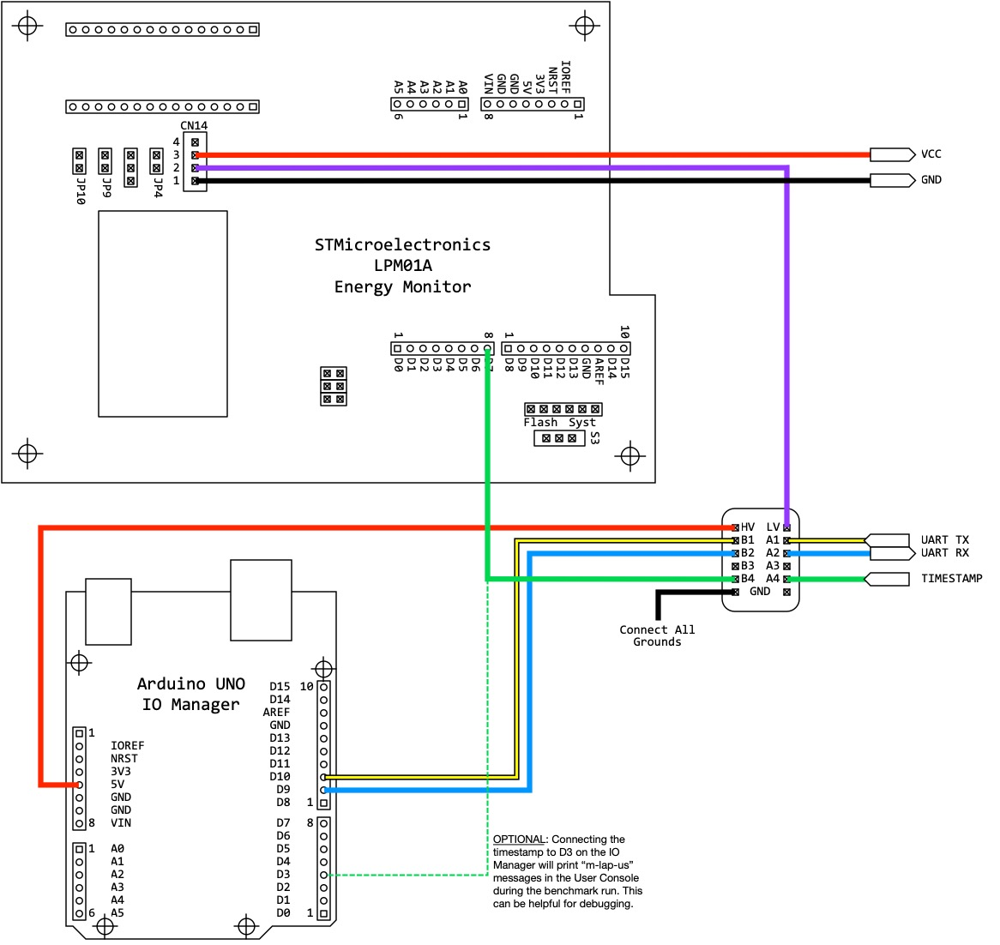
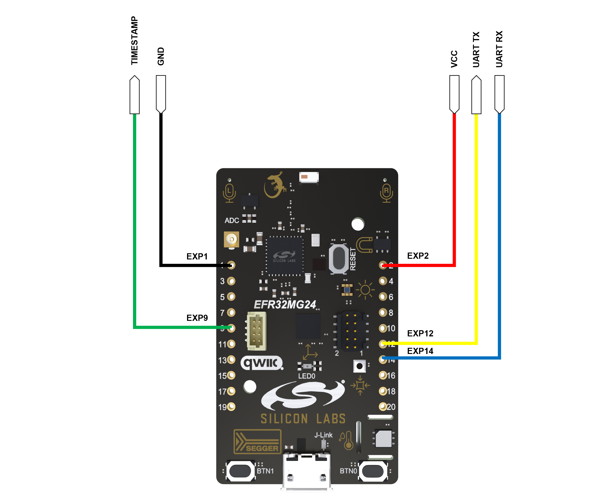

# Energy Mode Connection 

Energy measurements have been conducted as described in [EEMBC/EnergyRunner - Energy Mode Hardware](https://github.com/eembc/energyrunner#energy-mode-hardware) with the 

* STMicroelectronics LPM01A (FW 1.0.6)
* Arduino UNO (flashed with io-manager_1.0.3.hex)
* Level shifters (of type BSS138)

The following section is an excerpt from the [EEMBC/EnergyRunner - Energy Mode Hardware](https://github.com/eembc/energyrunner#energy-mode-hardware) section, and describes the connectiviy of the Energy Monitor and IO-Manager

## Energy Monitor and IO-Manager Connections
Below, the LPM01A provides two supplies: measured VOUT (CN14.3) and *un-*measured VDD (CN14.2). VOUT is used to power the device under test only, whereas VDD provides the low-voltage supply to the level shifters because VDD=VOUT. The high-side of the level shifter is provided by the Arduino UNO, which is 5V. This allows the DUT to run at 1.8V to 3.3V, and still be able to talk to the Arduino at 5V. Since low-voltage is supplied by the un-measured source, it does not count toward the joules used by the DUT.

The yellow line is the output of the DUT UART (Tx), which goes into the Arduino UNO Rx. Likewise, the blue line out of the Arduino UNO transmits to the DUT Rx through the level shifter. Same goes for the timestamp. While the source code claims it needs to be an open-drain, push-pull will work as well, since the level shifter essentially converts open drain to push pull. Pin D7 of the LPM01A listens for falling edges and logs a timestamp.

## xG24_DK2601B Connections
The image below shows the connections of the xG24_DK2601B. 

