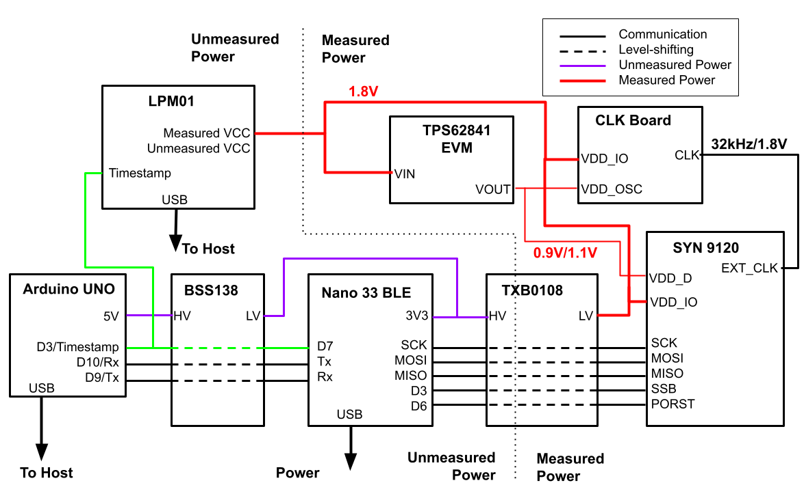

# Syntiant 9120 Submissions
Syntiant has two submissions, both using the 9120 development board, which includes the NDP120 Neural Decision Processor, an edge-focused neural network inference chip.

## Quantization
The model is quantized from the reference model using Syntiant's Training Development Kit (TDK).  The input features and final outputs are 16-bit integers.  All weights are 8-bit integers.  The internal activations are uniformly and symmetrically quantized to 8-bits, though 16-bit integers are used before applying the activation function.

## Hardware Setup
The 9120 uses two supply voltages, VDD_IO, set to 1.8V for these submissions, and VDD_D, which powers the digital core.  With VDD_D=0.9V, the NDP120 can run up to 30MHz.  With VDD_D=1.1V, the NDP120 can run at up to 100 MHz.  The two submissions demonstrate these two voltage/frequency combinations -- emphasizing efficiency at the lower voltage and throughput at the higher voltage.  

The NDP120 lacks an easily accessible UART, so an Arduino Nano 33 BLE is used to bridge communications between the energy runner and the 9120 board.  The Nano is powered via its USB connector, as illustrated below.  Its power is not measured for this benchmark.

A TI TPS62841 switching DC/DC converter (housed on this [evaluation board](https://www.ti.com/tool/TPS62841-2EVM123)) is used to convert 1.8V down to 1.1V or 0.9V.  The power consumption of the TPS is included in the _measured_ power consumption of the benchmark.  The TPS62841 EVM evaluation board is available from Digi-Key or TI. 

An external 32kHz clock generator ([schematic here](https://github.com/jaycordaro/clkbrd3/blob/main/schematic/clkbrd3.pdf)) is used to provide a clock signal.  It also uses a 0.9V/1.1V supply for the core oscillator and 1.8V for I/O. The clock board power consumption is also included in the measured power consumption.

The Nano 33 uses 3.3V I/O.  To communicate with the 9120 board a TXB0108 level shifter ([available](https://www.adafruit.com/product/395) from AdaFruit) is used.  The 3.3V supply for the level shifter is drawn from the Nano's 3.3V supply and not measured.  The 1.8V side is powered from the measured 1.8V supply, to ensure that there is no parasitic power provided to the 9120 through the I/Os.

 