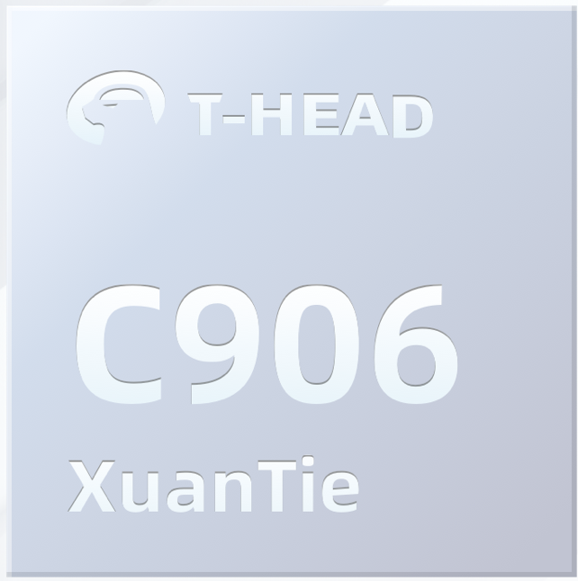
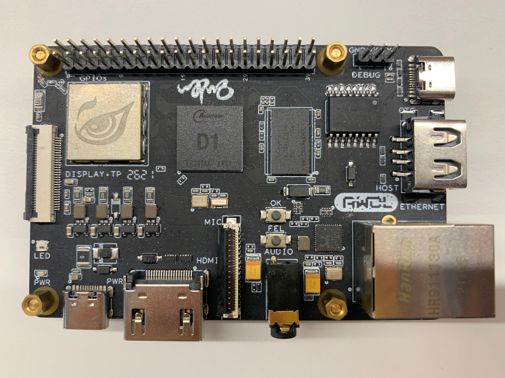
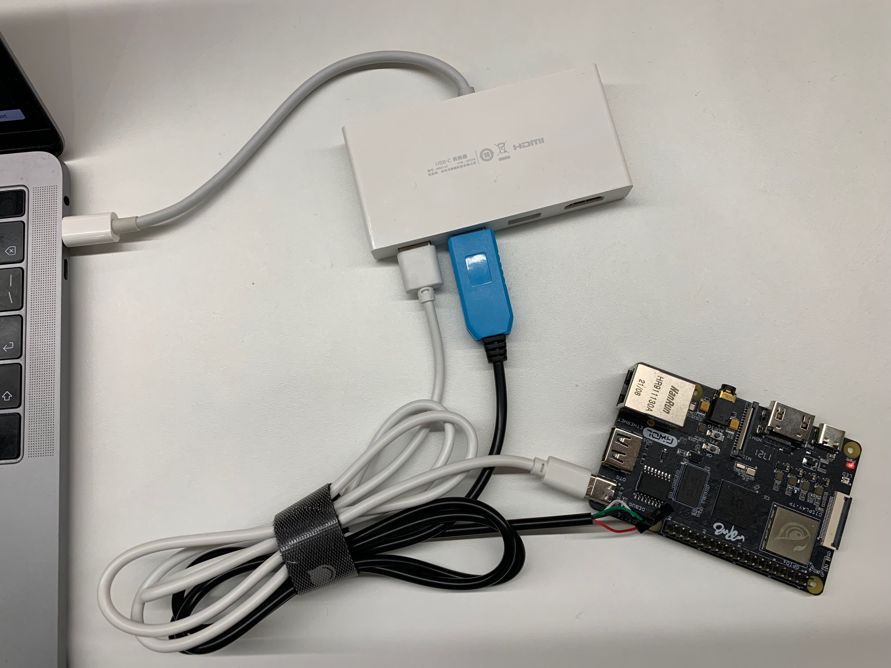
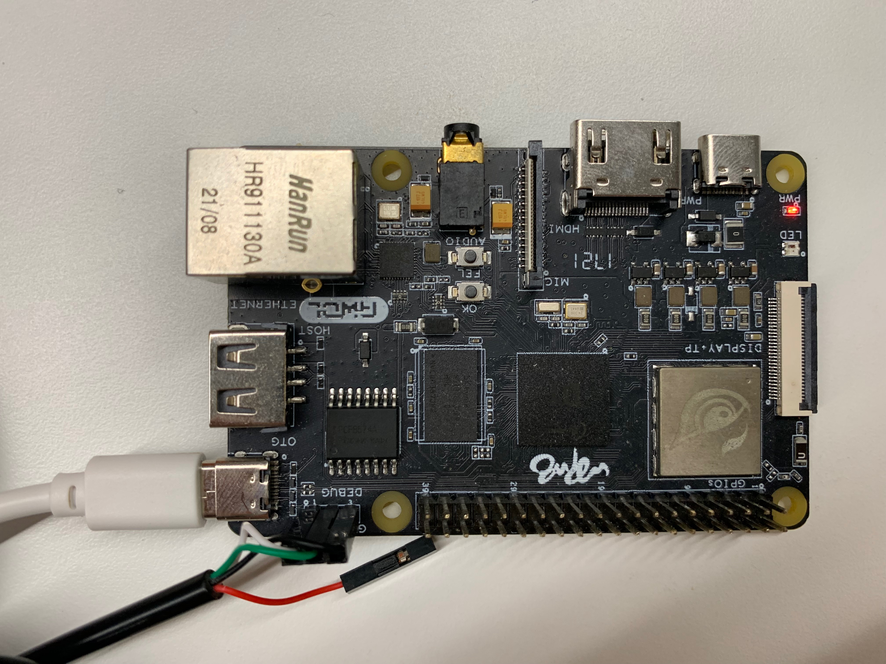

# Tiny MLPerf v0.7 Alibaba Submission

This is a repository of Alibaba Cloud implementations for MLPerf Tiny v0.7.

## Introduction


Alibaba Cloud Sinian team focuses on heterogeneous hardware acceleration and co-optimization between software and hardware, to deliver extreme performance for machine learning applications.  In cooperation with Alibaba T-HEAD team, as well as Alibaba Cloud IoT team, Ant Group IoT team, Alibaba Damo Academy Voice Lab team, we demonstrate our hardware and software co-optimization on MLPerf Tiny benchmarks with Alibaba T-HEAD's XuanTie C906 RISCV CPU.


## Hardware 


The hardware we utilize for Tiny benchmarks is `D1` which adopts Alibaba T-HEAD's `Xuantie C906 RISCV processor IP`. More infomation about `Xuantie C906 RISCV processor ` can be found on [Alibaba T-HEAD's webpage](https://www.t-head.cn/product/C906?lang=en), and information about `D1` can be found on [vendor webpage](https://www.allwinnertech.com/index.php?c=product&a=index&id=97).





## Setup

### Hardware connection

Connect D1 with your laptop via USB-C and UART wires as shown in the picture below.

- USB-C connection (white cable) is for power and push runtime to the D1 board

- UART connection (black cable) is for EEMBC runner to send test commands and test data. Note that the red wire is not needed since we power up the board via USB-C

  

  

### Prepare tools and environments

Pull the docker image

```bash
docker pull hhb4tools/hhb:1.10.18
```

Download Xuantie GCC toolchain

```
wget https://occ-oss-prod.oss-cn-hangzhou.aliyuncs.com/resource/1836682/1638774253840/Xuantie-900-gcc-linux-5.10.4-glibc-x86_64-V2.2.3-20211204.tar.gz
tar -zvxf Xuantie-900-gcc-elf-newlib-x86_64-V2.2.3-20211204.tar.gz
```

Start a container using the docker image downloaded, and put the Xuantie GCC toolchain into the container created at any arbitrary path, say `/tools/Xuantie-900-gcc-linux-5.10.4-glibc-x86_64-V2.2.3`.

Don't forget the add it to `PATH` 

```
export PATH=/tools/Xuantie-900-gcc-linux-5.10.4-glibc-x86_64-V2.2.3/bin/:$PATH
```

Download csi-nn2

```
git clone https://github.com/T-head-Semi/csi-nn2
cd csi-nn2
make nn2_c906
make install_nn2
```

Then move or copy `install_nn2` to `open/Alibaba/code` 

```
cp -r install_nn2 open/Alibaba/code
```

### Prepare the EEMBC test dataset

While dowloading the docker image, you can start preparing the test data needed by [EEMBC runner](https://github.com/eembc/energyrunner) on your laptop. Guidances  for each test dataset preparation are as follows:

You will need these packages to start.

```
opencv 3.4.2
python 3.7.x or equivalent version
numpy  1.20.3 or equivalent version
```

#### 1. Visual wake word

Download original dataset if you don't have it already.

```
cd open/Alibaba/code/sinian/vww/vww_testdata
wget https://www.silabs.com/public/files/github/machine_learning/benchmarks/datasets/vw_coco2014_96.tar.gz
tar -xvf vw_coco2014_96.tar.gz
```

Obtain the test data list `y_labels` from https://github.com/eembc/energyrunner/blob/main/datasets/vww01/y_labels.csv. (For convenience, `y_labels` is already place at `open/Alibaba/code/sinian/vww/vww_testdata`)

Extract the test data needed by EEMBC runner and convert to bin

```
python get_vww_testdata.py
```

Place the generated `vww01` folder along with `y_labels.csv`  to  `~/eembc/runner/benchmarks/ulp-mlperf/datasets/`  as requested by EEMBC runner.

#### 2. Keyword Spotting

Keyword Spotting test dataset is directly downloaded from EEMBC github page https://github.com/eembc/energyrunner/tree/main/datasets/kws01

Place the  `kws01` folder along with `y_labels.csv`  to  `~/eembc/runner/benchmarks/ulp-mlperf/datasets/`  as requested by EEMBC runner.

#### 3. Anomaly Detection

Please follow the official instruction [here](https://github.com/mlcommons/tiny/blob/master/benchmark/training/anomaly_detection/convert_dataset.py) to prepare the testdata bin. 

Then Place the  `ad01` folder along with `y_labels.csv`  to  `~/eembc/runner/benchmarks/ulp-mlperf/datasets/`  as requested by EEMBC runner.

####  4. Image Classification

Download cifar10 dataset if you don't have it already.

```
cd open/Alibaba/code/sinian/ic/ic_testdata
wget https://www.cs.toronto.edu/~kriz/cifar-10-python.tar.gz
tar -xvf cifar-10-python.tar.gz
```

Obtain the new banlanced test data indexes `perf_samples_idxs.npy` from offical github page https://github.com/mlcommons/tiny/blob/master/benchmark/training/image_classification/perf_samples_idxs.npy  (For convenience, `perf_samples_idxs.npy` is already place at `open/Alibaba/code/sinian/ic/ic_testdata`)

Fill in the cifar10 dataset path  `cifar_10_dir ` in file `get_ic_testdata_and_csv_new.py` , then run it to generated `ic01` as well as `y_labels.csv` 

```
python get_ic_testdata_and_csv_new.py
```

Place the generated `ic01` folder along with `y_labels.csv`  to  `~/eembc/runner/benchmarks/ulp-mlperf/datasets/`  as requested by EEMBC runner.

## Build Instruction

### Compile model and EEMBC code for each benchmark

In the docker container we have just prepared, do the following:

#### 1. Visual wake word

Compile model

```bash
cd open/Alibaba/code/sinian/vww/vww_model
./compile_command.sh
```

Then compile eembc runner code

```bash
cd open/Alibaba/code/sinian/vww/vww_runner
./compile_command.sh
```

#### 2. Keyword Spotting

Compile model

```bash
cd open/Alibaba/code/sinian/kws/kws_model
./compile_command.sh
```

Then compile eembc runner code

```bash
cd open/Alibaba/code/sinian/kws/kws_runner
./compile_command.sh
```

#### 3. Anomaly Detection

Compile model
```bash
cd open/Alibaba/code/sinian/ad/ad_model
./compile_command.sh
```

Then compile eembc runner code
```bash
cd open/Alibaba/code/sinian/ad/ad_runner
./compile_command.sh
```
#### 4. Image Classification

Compile model

```bash
cd open/Alibaba/code/sinian/ic/ic_model
./compile_command.sh
```

Then compile eembc runner code

```bash
cd open/Alibaba/code/sinian/ic/ic_runner
./compile_command.sh
```

### Push the executable to D1

D1 utilizes Android Debug Bridge(ADB) to transfer data between your laptop and D1. 

On your laptop, take mac as an example, install ADB using commands below.

```bash
/usr/bin/ruby -e "$(curl -fsSL https://raw.githubusercontent.com/Homebrew/install/master/install)"
brew cask install android-platform-tools
```

Push the compiled runtime to the board using command:

```bash
adb push open/Alibaba/code/sinian/vww/vww_runner  /root/
adb push open/Alibaba/code/sinian/kws/kws_runner  /root/
adb push open/Alibaba/code/sinian/ad/ad_runner  /root/
adb push open/Alibaba/code/sinian/ic/ic_runner  /root/
```

Destination directory can be arbitrary.

### Launch the executable on D1

Since the EEMBC uses UART for sending commands and data, we utilize`minicom`  to launch the compiled runtime on D1.

Install minicom using command

```
sudo apt-get install minicom
```

Use command  `minicom -s` to configure minicom serial port setup (in my case the serial port of D1 is `/dev/tty.usbserial-A50285BI  `)

After minicom setup, use command `minicom ` to connect to D1, and launch the compiled runtime on D1:

```
cd /root/<benmark_name>_runner
./c_runtime
```

Close the terminal tab in which minicom resides to avoid EEMBC UART confliction.

### Use EEMBC runner and do the testing

Open EEMBC runner and do the accuracy/performance test.


