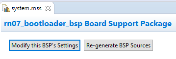
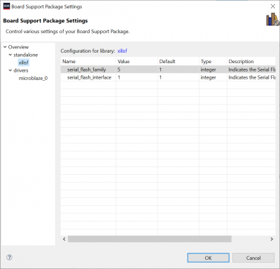
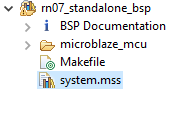

# Boot from Flash
### Configure Bootloader Parameters
1. In the SDK, expand  `<project>_bootloader_bsp` in _Project Explorer_

	 

2. Open `system.mss` and click `Modify this BSP's Settings`. 

	 

3. Select "xilifs" under `Overview > Standalone` and modify the `value` column of the two entries to match the following, then click `OK`:
	1.  `serial_flash_family` = `5`
	
	    `serial_flash_interface` = `1`

	 

4. On the `system.mss` page, click `Regenerate BSP sources`. 

	 

5. Next,  in the  _Project Explorer_, expand  `<project>_bootloader` and open `/src/blconfig.h`  

	 

6. Change the value of `#DEFINE FLASH_IMAGE_BASEADDR` to `0x003D0900`, then save the file

	 

7. Next,  in the  _Project Explorer_, under  `<project>_bootloader`, open `/src/bootloader.c`

	 

8.  in `bootloader.c`, Scroll down to where the preprocessor directive VERBOSE is declared and comment it out, then save the file

	 

### Configure the Test Harness to for the bootloader
9. In the SDK, expand  `<project>_standalone_bsp` in _Project Explorer_

	 

10. Open `system.mss` and click “Modify this BSP's Settings”.

	 
11. Under `Overview` check `xilisf` in the list of libraries to add it to the BSP 

	 

12. Select `xilifs` under `Overview > Standalone` and modify the `value` column of the two entries to match the following, then click `OK`:
	1.  `serial_flash_family` = `5`
	
	    `serial_flash_interface` = `1`

	 

13. On the `system.mss` page, click “Regenerate BSP sources”. 

	 

14. Build all projects by selecting `Project > Build All` in the xSDK toolbar

### Flash the Bootloader & Test Harness

15. Open Program FPGA `Xilinx Tools > Program FPGA` and select  `<project>_bootloader\Release\<project>_bootloader.elf`  under `ELF/MEM File to Initialize in block RAM`
16. Press `Program` to program the FPGA of the device and generate the `download.bit` file we need to continue.

	 

	1.  If you have multiple Xilinx boards attached, or are otherwise experiencing "device not found" type issues, press "Select..." where it's specifying "Device" on this popup, untick "Auto Detect" on the subsiquent popup, selecting your relevant board if need be, then press "OK"

		
		
	
		afterwards, the "Device" field should be your specific board, such as:

		
	
17. At some point during programming, the green "Done" LED on your board should briefly turn off (if it's not already), then back on, indicating successful programming

	 

18. To program the Bootloader into memory, Open the `Program Flash` utility 

	

19. Set `Image File` to `...\design_1_platform\download.bit`,

	Set `Offset` to `0x0`, 

	and set `Flash Type` to `s25fl128sxxxxx0-spi-x1_x2_x4`.

20. Check  `Blank Check After Erase` and `Verify After Flash`, and click  `Program`. 

	

21. To program the Test Harness into memory, Once flashing of the bootloader is complete and successful, re-open the `Program Flash` utility 

	

22. Set `Image File` to `...\<project>_standalone\Release\<project>_standalone.elf`,

	Set `Offset` to `0x0x003D0900`, 
	
	and set `Flash Type` to `s25fl128sxxxxx0-spi-x1_x2_x4`.

23. ***UNCHECK***  `Blank Check After Erase`, **CHECK** `Convert ELF to bootloadable SREC format and Program` and `Verify After Flash`, and click  `Program`. 

	
	
