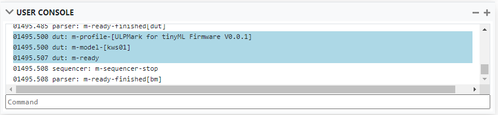

## Build stitched-IP for MLPerf tiny and bitfile for PYNQ

The build is currently configured for the PYNQ-Z2 board and a throughput of about 200k FPS at a clock frequency of 100 MHz.

1. Copy the trained `QONNX_model.onnx` model from the training folder. The command is: `cp ../../training/training_checkpoint/QONNX_model.onnx .`
2. (Optional) Download the pre-processed validation data using the `get-kws-data.sh` script.
3. Launch the build as follows:
```shell
# cd to where the FINN compiler was cloned to
cd ../finn
# launch the build on the build foler
bash run-docker.sh build_custom ../pynq-z2
```

4. The generated outputs will be exported to a folder called `<timestamp>_output_<onnx_file_name>_<platform>`. 
You can find a description of the generated files [here](https://finn-dev.readthedocs.io/en/latest/command_line.html#simple-dataflow-build-mode).
The folder will additionally include the quantized inputs for verification (`all_validation_KWS_data_inputs_len_10102.npy`) and the expected outputs (`all_validation_KWS_data_outputs_len_10102.npy`).
When running the network on hardware the validation should achieve an accuracy of about 84.6 %. Note that this accuracy is NOT the test accuracy, but the validation accuracy. Verifying the test accuracy can be done with the the bare metal application and the re-quantized bin files described in the next section.

## Creating the bare metal application for MLPerf tiny
The following steps are adapted from original instructions by Giuseppe:

1. Make sure the shell has access to the Vivado 2019.1 tools and SDK, by setting the PATH environment variable to include them.
2. Run the Vivado project script: 

```shell
cd vivado_project/sys
make sys-hlsmover
```

3. The Vivado script essentially opens the FINN project and exports the HDF file for the SDK in the directory `vivado_project/sdk/hdf/`. Note that when we use HLS datamovers we don't have to create our own Vivado project (as with the AXI DMA IP).
4. Finally, let's create the SDK project + running it:
```shell
cd vivado_project/sdk
make sdk-hlsmover
make gui
```
5. This will pop up the SDK, close the "welcome" tab and you should have the bare metal app.
6. The SDK project now contains all harness files to build the harness and run the accelerator + harness on the FPGA.
7. Note: For accuracy/timing measurements the UART baud rate needs to be set to `115200`, while for power measurements the baud rate needs to be `9600`.
8. Program the FPGA with the bit file in SDK
   * 
9. Run test harness software in SDK
   * 
10. Download EEMBC runner GUI and for the dataset the KWS bin files have been re-quantized for this network, they can be found in the following folder, relative to here: `../../training/kws_bin_files`

## Running benchmarks
**Before proceeding, make sure the dataset `.bin`  and `y_labels.csv` files are in the location specified by the runner!**


If you're intending to run **energy (power consumption)** benchmarks, please refer to the connection and setup guide below for your relevant board **before proceeding**:

- [Pynq-Z2 Energy Benchmark Hookup and Setup Guide](pynq_energy_setup.md)

### **accuracy and/or latency (performance)** benchmarks:

#### Pynq-Z2
0. If you haven't already, download and open "EEMBC EnergyRunner Framework x.x.x" ("EEMBC EnergyRunner Framework 3.0.10" at time of this release)
1. Mount the Device by clicking the "Mount?" toggle in the devices list

	

2. Once mounted, Under "Benchmarks and Test Scripts", select "ML Performance x.x.x " ("ML Performance 1.0.1" at the time of this release)
	
3. If running **latency (performance)** benchmarks, enter the number of inferences you to run (official runs require at least 10s of runtime or 10 inferences, the number will vary depending on model/device) in the "Inferene Iterations" of the "Setup" portion. ("Warmup Iterations" can be left at 1)

	

4. Press the "Initalize" to initalize the EEMBC Runner with the appropriate benchmark info, you should see some blue highlighted output in the console and some of the runner's fields populated with info about the current model on the board

	
	

5. If running the **latency (performance)** benchmark, select the "Median Performance" radio button, otherwise if running the **acccuracy**  select the "Accuracy" Radio button, then press "Run" to start the benchmark

	

6. Once completed, the results of the benchmark will be printed out to the console, along with relevant logs (results included) being saved to the `~/eembc/runner/sessions` in a directory named the timestamp of when the benchmark completes


### **Energy Consumption (Power)** benchmarks:

#### Pynq-Z2
0. If you haven't already, download and open "EEMBC EnergyRunner Framework x.x.x" ("EEMBC EnergyRunner Framework 3.0.10" at time of this release)
1. Make sure you have flashed the FSBL to the Pynq so that it's able to cold boot the accelerator and Test Harness, as described in the [Pynq Bootloader Readme](pynq_bootloader.md)
2. Make sure you've connected all required devices as described in the [Pynq Energy Setup Readme](pynq_energy_setup.md)
1. Mount the iomanager (Arudino Uno) and energy monitor (Joulescope) in the energy runner

	

2. Once mounted, Under "Benchmarks and Test Scripts", select "ML Energy x.x.x " ("ML Performance 1.0.1" at the time of this release)

	
	
3. **_Make sure the power supply voltage is set to 5 Volts!_**, then press initalize to initalize the runner with test info. _**This will take up to 10 seconds!**_ During this time, the Pynq will briefly power on, send a message via the iomanager, then power back off. 

	

5. If initilization is successful, you will see information about the loaded model in the device. Enter the number of inferences you to run (official runs require at least 10s of runtime or 10 inferences, the number will vary depending on model/device) in the "Inferene Iterations" of the "Setup" portion. ("Warmup Iterations" can be left at 1)

	

6. Select the "Median Energy" radio button, then press "Run" to start the benchmark

	

6. Once completed, the results of the benchmark will be printed out to the console, with a plot of energy usage over the duration of the benchmark displayed below the console.  along with relevant logs (results included) being saved to the `~/eembc/runner/sessions` in a directory named the timestamp of when the benchmark completes

